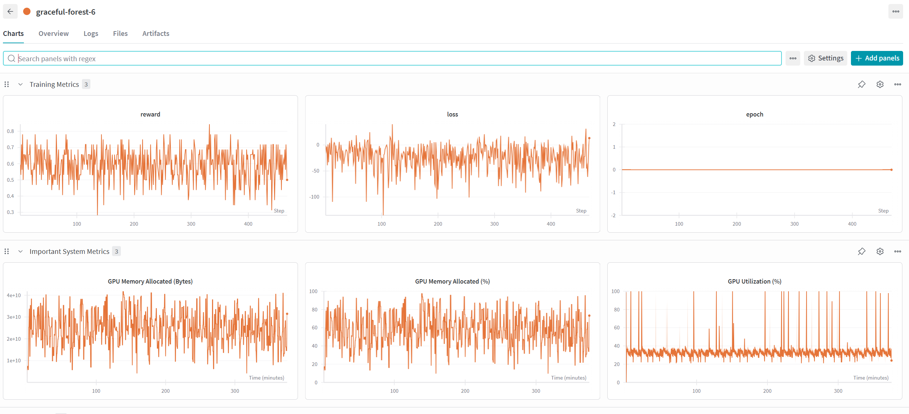

# **TinyLoRA** 🐁

This repository is an attempt to reproduce the paper "Learning to Reason in 13 Parameters" (https://arxiv.org/abs/2602.04118v1). So far, I've gotten most of the minimal implementation fleshed out, though some parts are still a bit unclear and/or the preprint isn't clear enough on certain details.

Here are my runs:
https://wandb.ai/spuun/tinylora

To run this, you'll need to have transformers, accelerate, and datasets installed.

Then you can run the training script with the following command:

```bash
accelerate launch --mixed_precision bf16 train_grpo.py \
    --model Qwen/Qwen2.5-1.5B-Instruct \
    --max_gen_len 512 \
    --max_seq_len 1024 \
    --batch_size 16 \
    --micro_batch_size 16 \
    --n_tie 196 \
    --proj_dim 13 \
    --k 2
```

This will get us 13 parameters from the `u`=13 and the `n_tie`=196 (where the number of modules is 28 layers × 7 modules per layer = 196 modules). You can try messing around with the parameters. _I am_, at least. Do let me know if you find anything interesting! :d

Here's one epoch


I _do_ think that you'd need a longer seqlen than that, though I'm still waiting on some compute to land on my end before I do much more, lol.

I'm also not entirely sure if the reward function is correct, but it's a start. It should be (I think? I didn't do KL on the GRPO, but that's what they said in the paper).

Another to-do is to use an inference engine or optimize the inference pipeline, since it's currently pretty slow on that front.

H- hmu if u can gime some compute or help w/ the implementation, k? 🥺👉👈
